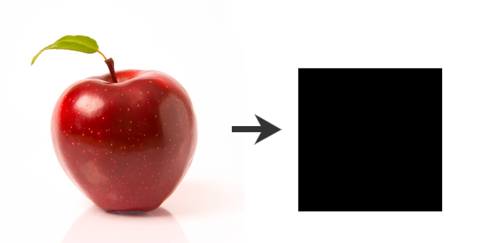

# Image Annotator

An Image Annotation App built using Python and Tkinter.

## Overview

The Image Annotation App is a simple tool that allows users to annotate images by drawing bounding boxes around objects of interest. This app can be used for various image annotation tasks, such as object detection or image labeling.

## Features

### Load Folder and Images

Click the "Load Folder" button to select a folder containing images for annotation. The app will display the first image from the folder.

### Annotate Images

Use your mouse to draw bounding boxes around objects in the displayed image. The app provides an interactive canvas for annotation.

### Navigation and Saving

Navigate between images using the "<" (previous) and ">" (next) buttons. After annotating an image, click the "Save Annotation" button to save the annotated image with bounding boxes.

### Keybinds
you can also use keybinds such as:

  1. ctrl + s (saves the annotation instantly without needing to press the button)
  2. left arrow (jumps to the image before)
  3. right arrow ( jumps to the next image)

### Visualize Annotations

Annotations are saved as new images with the same size. it displays a black square in the place of the selected bounding box.

## License

This project is licensed under the Apache 2.0 License. See [LICENSE](LICENSE) for details.

